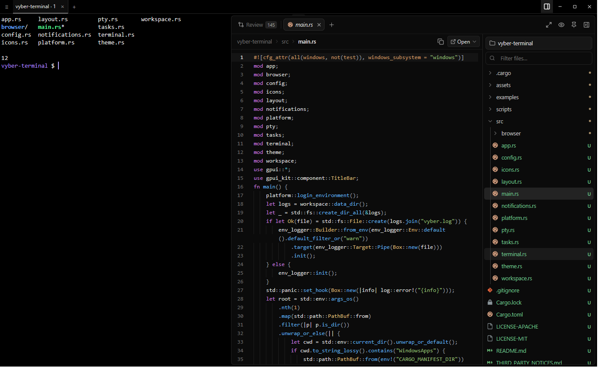

<p align="center">
  
</p>

<h1 align="center">Vyber</h1>

<p align="center">
  <strong>Your terminal, files, and Git review in one native workspace.</strong><br>
  Run your favorite CLI tools, preview and edit files beside your terminal, and review code changes
  by turn when using Claude Code or Codex.
</p>

<p align="center">
  Built in Rust with <a href="https://github.com/longbridge/gpui-kit">GPUI Kit</a> and the
  <a href="https://github.com/alacritty/alacritty">Alacritty</a> terminal core.
  Native, GPU-rendered, and open source under MIT or Apache-2.0.
</p>

<p align="center">
  <a href="https://github.com/TNYCL/vyber-terminal/releases/latest"><strong>Download Vyber</strong></a>
  · <a href="#getting-started">Getting started</a>
  · <a href="#workflows">Workflows</a>
  · <a href="#configuration-and-local-data">Configuration</a>
  · <a href="#build-from-source">Build from source</a>
  · <a href="#contributing">Contributing</a>
</p>

<p align="center">
  
</p>

## Installation

Choose your operating system and processor from the
[latest release](https://github.com/TNYCL/vyber-terminal/releases/latest).

| Platform | Package | Install and launch |
| --- | --- | --- |
| Windows x64 | ZIP | Extract to a writable folder and run `Vyber.exe`. |
| macOS Apple Silicon | DMG, ARM64 | Drag `Vyber.app` to Applications. |
| macOS Intel | DMG, x64 | Drag `Vyber.app` to Applications. |
| Linux x64 | tar.gz, x86_64 | Extract, open the package folder, and run `./bin/vyber`. |
| Linux ARM64 | tar.gz, aarch64 | Same steps; desktop support is experimental. |

**Platform status:** Code and release checks cover all five targets; desktop/GPU compatibility is still being verified
on macOS/Linux. Windows 11 is the development platform. Windows packages are unsigned; macOS
packages are ad-hoc-signed, not notarized, and may encounter OS security prompts. macOS 12 is a
build target, not a verified minimum.

**Requirements:** Git for source control and review; optional
[ripgrep](https://github.com/BurntSushi/ripgrep) (`rg`) for content search. Linux needs compatible
graphics drivers, fonts, and XDG utilities; the package's `INSTALL.md` covers runtime requirements
and desktop integration. Notifications need a session notification service.

Compare your package's SHA-256 with its own entry in the same release's `SHA256SUMS.txt`.
See [download verification](docs/RELEASING.md#verify-downloads) for additional verification and
provenance.

## Getting started

1. **Open a repository.** Use Open folder, or `vyber .` if Vyber is on your `PATH`.
2. **Run your tools.** Start shell commands, `claude`, or `codex` as usual. Agent CLIs are installed
   and authenticated separately.
3. **Inspect changes.** Browse files beside the terminal; click a live turn badge to open Review.
   Use a manual checkpoint for other commands.
4. **Finish in Git.** Stage changes, write a commit, and push from Source Control.

Automatic turn review reads local logs and process information. It compares snapshots, so
concurrent or manual edits may also appear. Review and checkpoints require Git.

A fresh launch opens your home directory. Workspace restoration reopens tabs, splits, folders,
files, and drafts in **new shells**; running commands and terminal output are not restored.
Passing a folder on the command line opens it instead of restoring the workspace.

## Workflows

### Review changes as you work

See changed files and line counts in a live Claude Code/Codex turn badge. Review all files in one
syntax-highlighted diff with split/unified views, folded unchanged lines, wrapping, and find.
The changed-files tree shows added, modified, and deleted files and jumps to each one.

Choose agent turns, checkpoints, working-tree/staged/unstaged changes, commits, or a branch diff.
Revert a hunk, file, or turn; leave a line comment in your CLI input without sending it.
Staged and committed views are read-only.

Snapshot capture uses a separate local object store and leaves your Git index, refs, stash, and
`.git/objects` untouched. Explicit saves, reverts, and Source Control actions can change files
or Git state. Reverts stop if affected files changed since capture/review; successful reverts
preserve recovery copies.

### Keep terminal sessions organized

Use named tab groups, split terminals, and drag-and-drop layouts. Shell processes keep running
through rearrangements; group names and focus are remembered.

Run TUI tools in real PTYs, with multiline Shift+Enter support for Codex and Claude Code.
Search scrollback and Ctrl/Cmd+click file paths or URLs. Font sizes persist, and background bells
or terminal notifications can trigger desktop notifications.

### Watch agents and jobs in the toolbelt

The toolbelt (Ctrl+Shift+J / Cmd+J) sits beside the terminals, on the right or left, and keeps
its width. **Jobs** shows the focused terminal's process tree with each command line; select a
process to end it (choose the signal on macOS and Linux). **Session Status** lists every terminal
running Claude Code or Codex as working, waiting for you, responded, or idle, with its latest
message. A reply stays green until you look at its terminal; click a session to go there. Tab
dots show the same states.

Claude Code reports its own state; for Codex, Vyber reads the session log, an approval question
on screen, and bells or notifications during a turn.

### Browse, preview, and edit beside the terminal

Each terminal has its own tree, open files, and preview. Float the file panel over the terminal
or dock it beside it; panel and sidebar sizes are remembered.

Fuzzy-find files, search contents with `rg`, and edit with syntax highlighting, search/replace,
undo/redo, line numbers, and atomic saves. Preview Markdown and images with zoom; **Follow** opens
files as they change, and **Pin** docks the preview.

### Work across projects

Name a set of source folders and choose a primary folder with ≡ ▸ Edit project…. Open a folder
containing repositories as a project, pick project folders/worktrees as tree roots, or use projects
discovered from the Codex app. Project metadata stays in Vyber's data directory.

### Manage Git in the same workspace

Stage, unstage, or discard files and hunks; commit, amend, fetch, pull, and push. Browse the commit
graph and manage branches, conflicts, remotes, and worktrees across project repositories.

Git uses your configuration, hooks, and credential helpers. **Git Output** shows every command;
background fetches do not prompt for credentials.

<details>
<summary><strong>Workflow details and safety</strong></summary>

**Review badges and sessions.** The badge is drawn over the terminal; it does not change terminal
size or become part of the agent's input. During TUI redraws it keeps its last verified position,
or moves to the top-right corner, including in scrollback. An active turn stays visible until
explicitly dismissed. Narrow panes keep the file count and show full totals in a tooltip.

Claude Code session process IDs and local process relationships identify its terminal. Codex
sessions are matched using their folder, running process, and recent submitted input. Two Codex
sessions started in the same folder at the same time can be mixed up. Turns from the Codex app or
an editor extension appear in Review without a terminal badge.

**Review scopes.** Commit views include recent commits; branch views compare against the merge base
with the default branch. Comments place `path:line — note` in terminal input without submitting it.
Turns running in overlapping folders are flagged because their changes can overlap. Diffs compare
observed file states; they do not establish which process authored every edit.

**Observation starts here.** Vyber follows new events from existing session logs when it starts.
A past transcript alone cannot reconstruct earlier file snapshots. Log formats are private
implementation details of the agent tools and can change; manual checkpoints provide another
review path, subject to the same Git and snapshot requirements.

**Projects and nested repositories.** A turn in a project's primary folder can cover project
repositories inside it. Discovery searches up to two folder levels, skips `.git`, `target`, and
`node_modules`, and stops descending once it finds a repository. Linked worktrees are excluded
when collecting repositories nested under another folder; they can still be selected directly
as workspace roots. Multi-repository snapshots have a 20,000-file limit. Tracked symbolic links
can prevent snapshot capture. Codex project discovery depends on the app's local data format.

**Revert and recovery.** If a file changed after the captured turn or since the diff was loaded,
revert stops and asks you to review the current version. Files overwritten or deleted by a
successful revert keep recovery copies. Source Control discards and hard resets also preserve
recovery copies. Inside the data directory's `recovery/`, each entry's `path.txt` records the
original path; `content`, when present, contains the saved file bytes. Inspect copies before
restoring them manually. Git commands that change files warn when an agent turn is active.

**Terminal protocols and shells.** Vyber uses ConPTY on Windows and supports true color, 256
colors, alternate screen, bracketed paste, OSC 8 links, and Kitty keyboard protocol negotiation.
Shift+Enter preserves its modifier for Codex/Claude Code; Windows also supports native console
input. Ctrl+T reaches the terminal application on Windows; Ctrl+Shift+T opens a Vyber tab.
Box-drawing, block, and Powerline characters join across cells.

Windows prefers Git Bash found through `PATH` or standard install locations, then PowerShell.
Unix uses a valid `$SHELL` with platform fallbacks. Shell profiles are never modified; macOS's
default zsh session reports directory changes. Tab labels use folder names unless renamed.
Ctrl/Cmd+click opens local paths such as `src/main.rs:42` in the file panel and URLs in the browser.

**Tabs and splits.** Double-click a group to name it; its context menu offers rename, split, and
close. The arrow beside `+` lists open groups. Split terminal titles have focus/restore and close
controls; a lone terminal needs no extra header. Drag a title to another pane's edge to move it,
or beside `+` to give it a separate tab. Group tabs keep their size when selected, and the strip
scrolls at its edges during a drag. See **All keyboard shortcuts** for closure behavior.

**Files and previews.** Overlay mode keeps terminal size unchanged; dock mode moves the terminal
aside. Drag the panel's left edge or the sidebar to resize them. The tree shows Git status colors
and includes hidden/ignored files such as `.git`, `target`, and `node_modules`. Folders load as
you expand them; the root picker and path menus let you navigate their contents.

Editor languages include Rust, Go, TypeScript/TSX, JavaScript, Python, JSON, TOML, Markdown, Bash,
CSS, and HTML. Images support PNG, JPEG, WebP, GIF, BMP, SVG, and ICO. Binary or oversized files
show an info card.

**Git actions.** Source Control shows a commit box, Merge/Staged/Changes groups, and a graph with
branch lanes, refs, and incoming/outgoing commits.

| Work with | Available actions |
| --- | --- |
| Changes | Stage, unstage, or discard selected files, all changes, or individual hunks; commit, amend, commit and push or sync, and undo the last commit. |
| Branches | Switch, create, rename, delete, publish, merge, or rebase; stash, carry over, or discard local changes when switching. |
| History | Check out remote branches, tags, or commits; cherry-pick, revert, or reset commits; manage stashes and tags. |
| Remotes and worktrees | Manage remotes and worktrees; fetch, pull with rebase, push, or force push with lease. |
| Conflicts | Continue or abort merges/rebases, or take either side of a conflict. |

</details>

## Updates

Official packages check for updates after 30 seconds and every six hours. New packages download
in the background and are verified by size and SHA-256. Click **Update** to install and restart;
running processes require confirmation.

Check manually with ≡ ▸ Check for updates, or Vyber ▸ Check for Updates… on macOS.
If Vyber cannot replace itself in a protected folder, read-only disk image, or temporary macOS
location, Update opens the release page for manual installation.

Drafts, prereleases, and source builds are excluded from automatic updates. Disable automatic
checks in [configuration](#configuration-and-local-data). Vyber 0.1.0 needs one manual upgrade.

## Configuration and local data

Open `config.toml` with the Settings file shortcut. For example:

```toml
font_size = 15.0
panel_mode = "dock"
restore_workspace = true
```

Font/panel settings apply when saved; `shell` and `scrollback` apply to new terminals.
Zoom affects the focused terminal, file panel, or Source Control independently.

| Platform | Default data directory |
| --- | --- |
| Windows | `%LOCALAPPDATA%\Vyber` |
| macOS | `~/Library/Application Support/Vyber` |
| Linux | `$XDG_DATA_HOME/Vyber`, or `~/.local/share/Vyber` |

Review history may include prompt excerpts; snapshots, recovery copies, and drafts contain file
content. They stay in this local directory. History settings filter displayed reviews and **do
not delete stored data**.

Vyber reads local agent logs and process information without installing hooks or using an agent
SDK. Official packages contact GitHub for updates; Source Control can fetch Git remotes.
Disable these automatic network actions with:

```toml
check_for_updates = false
git_autofetch = false
```

Manual checks, explicit Git operations, and tools you run have their own network behavior.

<details>
<summary><strong>Configuration reference</strong></summary>

Leave `shell` unset to use the platform default: Git Bash then PowerShell on Windows, or a valid
`$SHELL` with platform fallbacks on Unix. Set a single executable name or path, without an
argument list, to choose another shell:

```toml
# Windows example; use a path that exists on your machine:
# shell = 'C:\Program Files\PowerShell\7\pwsh.exe'

# Unix example:
# shell = "/bin/zsh"
```

| Setting | Default | Behavior |
| --- | --- | --- |
| `shell` | Automatic | Shell executable; applies to new terminals. |
| `font_family` | Consolas / Menlo / DejaVu Sans Mono | Windows / macOS / Linux terminal font. |
| `font_size` | `14.0` | Terminal text, 8–32. |
| `files_font_size` | `12.0` | File tree, editor, previews, and Review text, 8–24. |
| `git_font_size` | `12.0` | Source Control text, 8–24. |
| `panel_mode` | `"overlay"` | `"overlay"` or `"dock"`. |
| `scrollback` | `20000` | History lines, 1,000–100,000; applies to new terminals. |
| `reduced_motion` | `false` | Reduce interface motion. |
| `notifications` | `true` | Desktop notifications for background terminal events. |
| `restore_workspace` | `true` | Restore layout, folders, files, and drafts on a later launch. |
| `task_history_days` | `14` | Age filter for displayed reviews; not a deletion schedule. |
| `task_history_limit` | `200` | Displayed review limit; not a disk quota. |
| `git_autofetch` | `true` | Fetch remotes every five minutes while Source Control is open. |
| `check_for_updates` | `true` | Automatic checks/downloads in official packages; manual checks remain available. |
| `toolbelt` | `true` | Show the toolbelt with Jobs and Session Status. |
| `toolbelt_side` | `"right"` | `"right"` or `"left"`. |
| `toolbelt_width` | `300.0` | Toolbelt width in pixels, 200–640; dragging its edge saves it. |
| `toolbelt_split` | `0.45` | Share of the toolbelt's height for Jobs, 0.15–0.85. |

| File or directory | Contents |
| --- | --- |
| `config.toml` | User settings. |
| `workspace.json` | Tabs, split layout, folders, open files, and unsaved editor drafts. |
| `projects.json` | Projects and source folders. |
| `git-drafts.json` | Unsent commit messages. |
| `checkpoints/`, `tasks/`, `recovery/` | Snapshot file content, review metadata, and recovery copies. |
| `updates/` | Downloaded update data. |
| `vyber.log` | Warnings/errors by default; recreated each launch. Vyber does not save a terminal transcript. `RUST_LOG` can enable verbose dependency diagnostics. |

Set `VYBER_DATA_DIR` to use a different data directory, for example for an isolated workspace.

</details>

## Keyboard shortcuts

| Action | Windows / Linux | macOS |
| --- | --- | --- |
| New tab | Ctrl+Shift+T | Cmd+T / Cmd+N |
| File panel | Ctrl+Shift+B | Cmd+B |
| Toolbelt | Ctrl+Shift+J | Cmd+J |
| Find file | Ctrl+Shift+P | Cmd+P |
| Source Control | Ctrl+Shift+G | Cmd+Shift+G |
| Manual checkpoint | Ctrl+Shift+K | Cmd+Shift+K |
| Settings file | Ctrl+Shift+, | Cmd+, |
| Shortcut help | Ctrl+Shift+H | Cmd+Shift+H |

<details>
<summary><strong>All keyboard shortcuts</strong></summary>

| Action | Windows | macOS | Linux |
| --- | --- | --- | --- |
| New tab | Ctrl+Shift+T | Cmd+T / Cmd+N | Ctrl+Shift+T |
| Split right (terminal focused) | Ctrl+D | Cmd+D | Ctrl+Shift+D |
| Split down | Ctrl+Shift+D / Ctrl+Shift+E | Cmd+Shift+D | Ctrl+Shift+E |
| Close active preview file, then panel, then focused terminal | Ctrl+Shift+W | Cmd+W | Ctrl+Shift+W |
| Quit (confirm running terminal processes) | Alt+F4 | Cmd+Q | Ctrl+Shift+Q |
| Next terminal | Ctrl+Shift+] | Cmd+] | Ctrl+Shift+] |
| Switch tab | Ctrl+Tab / Ctrl+Shift+Tab | Ctrl+Tab / Ctrl+Shift+Tab | Ctrl+Tab / Ctrl+Shift+Tab |
| Go to tab 1–8 / last tab | Ctrl+1…8 / Ctrl+9 | Cmd+1…8 / Cmd+9 | Ctrl+1…8 / Ctrl+9 |
| Maximize terminal | Ctrl+Shift+Enter | Cmd+Enter | Ctrl+Shift+Enter |
| File panel | Ctrl+Shift+B | Cmd+B | Ctrl+Shift+B |
| Toolbelt | Ctrl+Shift+J | Cmd+J | Ctrl+Shift+J |
| Source control | Ctrl+Shift+G | Cmd+Shift+G | Ctrl+Shift+G |
| Find file | Ctrl+Shift+P | Cmd+P | Ctrl+Shift+P |
| Search terminal history | Ctrl+Shift+F | Cmd+F | Ctrl+Shift+F |
| Open folder | Ctrl+Shift+O | Cmd+O | Ctrl+Shift+O |
| Manual checkpoint | Ctrl+Shift+K | Cmd+Shift+K | Ctrl+Shift+K |
| Save in editor | Ctrl+S | Cmd+S | Ctrl+S |
| Close the file in the panel (the panel when no file is open) | Ctrl+W | Cmd+W | Ctrl+W |
| Next / previous panel tab | Ctrl+Tab / Ctrl+Shift+Tab, Ctrl+PgDn / Ctrl+PgUp | Ctrl+Tab / Ctrl+Shift+Tab | Ctrl+Tab / Ctrl+Shift+Tab, Ctrl+PgDn / Ctrl+PgUp |
| Find in the Review diff | Ctrl+F | Cmd+F | Ctrl+F |
| Copy / paste in terminal | Ctrl+Shift+C / V | Cmd+C / V | Ctrl+Shift+C / V |
| Settings file | Ctrl+Shift+, | Cmd+, | Ctrl+Shift+, |
| Shortcut help | Ctrl+Shift+H | Cmd+Shift+H | Ctrl+Shift+H |
| Font size of the focused terminal or panel: up / down / reset | Ctrl++ / Ctrl+- / Ctrl+0 | Cmd++ / Cmd+- / Cmd+0 | Ctrl++ / Ctrl+- / Ctrl+0 |

**Closing safely.** Close first removes the displayed file, then the panel, then the focused
terminal. Other split terminals keep running. A pane's close button closes that pane; closing
an entire group is explicit and checks all its terminals. Unsaved editor changes block closure,
and running agent sessions or background jobs require confirmation. Cancel keeps them running.

Closing the last terminal, or exiting its shell, leaves an empty workspace; New tab opens a new
session. Closed terminals are removed from the saved workspace. Quit checks all terminals and
saves the remaining layout and drafts. If process inspection is unavailable, closing a live
terminal requires confirmation.

On macOS, closing the window leaves the app running. Dock/Finder relaunch opens a workspace
window, and New tab and Quit work from the native menu with no window open. Unix process checks
read names, without command arguments.

**File tree navigation.** Use ↑/↓ to move, →/← to expand or collapse, Enter to open, and Space
for quick look. In the filter box, Enter opens the best match and Shift+Enter searches contents.

</details>

## Build from source

Install Rust via rustup, Git, and your platform's native build tools below. Rustup uses the pinned
toolchain in [`rust-toolchain.toml`](rust-toolchain.toml), currently **1.98.1**.

```sh
git clone https://github.com/TNYCL/vyber-terminal.git
cd vyber-terminal
cargo build --release --locked
```

Run `./target/release/vyber` on Unix or `.\target\release\vyber.exe` on Windows.
Pass a folder to open it; `--help` and `--version` show CLI help and the build version.

<details>
<summary><strong>Platform build instructions</strong></summary>

**Windows.** Use the MSVC Rust toolchain and Visual Studio Build Tools with the Desktop development
with C++ workload. The repository uses a static CRT. The helper also copies the binary to
`dist/Vyber.exe` and creates a `Vyber.lnk` shortcut in the project root:

```powershell
.\scripts\build.ps1
.\scripts\build.ps1 -Release
.\dist\Vyber.exe "C:\path\to\project"
```

The first command uses the development profile; `-Release` builds an optimized binary.
The shortcut contains local paths and is intended for your checkout.

**macOS.** Install the Xcode command line tools. To build an ad-hoc-signed `.app` bundle:

```sh
bash scripts/build-macos.sh
bash scripts/build-macos.sh --install
```

The bundle is written to `dist/Vyber.app`; `--install` copies it to `/Applications`.
This local helper path is untested and does not notarize the app.

**Linux.** On Ubuntu, the supplied script installs native build dependencies, fonts, and
test/desktop utilities using `apt` and `sudo`:

```sh
bash scripts/install-linux-deps.sh
cargo build --release --locked
./target/release/vyber /path/to/project
```

For other distributions, use equivalent packages; the script is Ubuntu-specific. CI builds on
Ubuntu 22.04 for x64 and ARM64, which does not establish compatibility with every distribution
or GPU.

For release archives, manifests, SBOMs, and publication checks, see
[Releasing Vyber](docs/RELEASING.md). Python 3.11+ is required for release tooling.

</details>

## Contributing

Bug reports, feedback, documentation improvements, and focused PRs are welcome.
In [GitHub Issues](https://github.com/TNYCL/vyber-terminal/issues), include your Vyber version,
OS/architecture, reproduction steps, and expected/actual behavior. For launch/GPU issues, add
graphics/session details. Remove sensitive content from screenshots and logs.

Explain your PR's user-visible change and run relevant checks:

```sh
cargo fmt --all -- --check
cargo clippy --locked --all-targets -- -D warnings
cargo test --locked --bin vyber -- --test-threads=1
```

For release-tool changes, also run `python -m unittest discover -s scripts/tests -v`.
For platform-specific UI changes, describe which desktop behavior you checked.

## Known limitations

- Agent logs and Codex project data are private formats; changes may interrupt discovery.
  Checkpoints remain an alternative when Git/snapshot requirements are met.
- Text preview is limited to 8 MB; file loading to 32 MB.
- Snapshot storage is not compacted automatically. History filters do not reclaim disk space.
- Concurrent turns can overlap; same-folder Codex sessions can be misassigned.
  See **Workflow details and safety**.
- Source Control has no generated commit messages, PR view, blame, or interactive rebase.
- PDF/web preview and LSP support are not available.

## License

Licensed under either of [Apache License, Version 2.0](LICENSE-APACHE) or [MIT license](LICENSE-MIT)
at your option. Unless you explicitly state otherwise, any contribution you submit for inclusion in
this project shall be dual licensed as above, without any additional terms or conditions.

Bundled file and UI icons come from Seti UI (MIT), Markdown Mark (CC0), and Lucide (ISC/MIT); see
[THIRD_PARTY_NOTICES.md](THIRD_PARTY_NOTICES.md) for these and all Rust dependency licenses.
